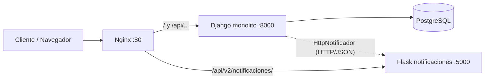

# Migración a Microservicios (Strangler Pattern)

## Módulo estrangulado: Notificaciones

Civix pasa de un monolito Django a una arquitectura híbrida: el monolito sigue
atendiendo todo, pero la **entrega de notificaciones** (antes
`proyectos/infra/notificadores.py`) se extrajo a un microservicio Flask
independiente, orquestado con Nginx y Docker.

## Matriz de decisión

Escala 1–5, donde **5 = más conveniente extraer**. (En acoplamiento, 5 = muy desacoplado.)
Pesos: Frecuencia de cambio 25 %, Consumo de recursos / I/O 30 %, Acoplamiento 45 %.

| Módulo | Frecuencia de cambio | Consumo de recursos / I/O | Acoplamiento | Puntaje ponderado | Decisión |
|---|:-:|:-:|:-:|:-:|---|
| Autenticación y sesiones | 3 | 3 | 1 | 2.10 | Mantener en Django |
| Gestión de proyectos | 3 | 2 | 1 | 1.80 | Mantener en Django |
| Inspecciones (+ bitácora y fotos) | 4 | 4 | 1 | 2.65 | Mantener en Django |
| **Notificaciones** | 4 | 4 | 5 | **4.45** | **Estrangular (Flask)** |

### Justificación por módulo

- **Autenticación:** el hash PBKDF2 consume CPU, pero `TokenAccesoAuthentication` se ejecuta en
  *cada* petición DRF y `Usuario` es FK de Proyecto, Inspección y Bitácora. Extraerlo rompería todo el sistema.
- **Proyectos:** depende de `Empresa`, `Suscripcion` (límites del plan) y `Usuario`; bajo consumo de recursos.
- **Inspecciones:** es el módulo más cambiante y pesado (fotos con Pillow), pero `confirmar_inspeccion()`
  escribe en `Inspeccion`, `Proyecto.porcentaje_avance` y `RegistroBitacora` dentro de **una sola transacción
  atómica**. Separarlo exigiría transacciones distribuidas.
- **Notificaciones (elegido):** no toca la base de datos; solo necesita destinatario, nombre del proyecto y
  mensaje. Hoy se invoca **dentro** de `@transaction.atomic` mientras se mantienen bloqueos
  `select_for_update`, así que un proveedor externo lento (SendGrid) alargaría esos bloqueos y afectaría a
  otros usuarios. Además cambia con frecuencia (nuevos canales: SMS, WhatsApp, push).
- **Ventaja técnica:** el monolito ya dependía de la abstracción `Notificador` (DIP + Factory), por lo que
  basta con una nueva implementación (`HttpNotificador`) sin modificar ningún Service ni vista.

## Arquitectura



## Solución arquitectónica

### Nginx
```nginx
server {
    listen 80;

    # Microservicio nuevo (ruta estrangulada)
    location /api/v2/notificaciones/ {
        proxy_pass http://flask_notificaciones:5000;
    }

    # Monolito legacy
    location / {
        proxy_pass http://django_web:8000;
    }
}
```

### Contrato del microservicio (JSON)

`POST /api/v2/notificaciones/`

```json
{
  "destinatario": "empresa@civix.test",
  "mensaje": "El proyecto 'Torre Aurora' fue creado exitosamente.",
  "proyecto": { "id": "uuid", "nombre": "Torre Aurora" },
  "canal": "email"
}
```

Respuestas: `201` notificación enviada · `400` validación/JSON malformado · `404` no encontrada ·
`415` Content-Type inválido · `500` error interno. Todos los errores usan el formato
`{"error": {"codigo", "mensaje", "detalles"}}`.

### Cómo se logró la separación técnica

1. Flask (`flask_notificaciones/app.py`) implementa la lógica de entrega y validación, con su propio `Dockerfile`.
2. Django mantiene el contrato `Notificador`; se añadió `HttpNotificador` y la Factory lo entrega con `ENV_TYPE=MICROSERVICIO`.
3. `docker-compose.yml` levanta `db`, `django_web`, `flask_notificaciones` y `nginx`.
4. **Resiliencia:** si Flask no responde (timeout de 3 s), el monolito no falla: registra el error y usa el notificador por consola.

## Impacto esperado

- El monolito deja de depender de la latencia del proveedor de correo para cerrar sus transacciones.
- Notificaciones puede desplegarse, escalarse y cambiarse (nuevos canales) sin tocar Django.
- Costo: una llamada de red más y un punto de falla adicional (mitigado con timeout + fallback).
- Limitación actual: el historial de notificaciones del microservicio vive en memoria; en un siguiente paso se persistiría (Redis/BD propia).

## Cómo ejecutar

```bash
docker compose up --build
# Probar el microservicio a través de Nginx:
curl -X POST http://localhost/api/v2/notificaciones/ -H "Content-Type: application/json" \
  -d '{"destinatario":"a@b.co","mensaje":"hola","proyecto":{"nombre":"Demo"}}'
# Monolito a través de Nginx:
curl http://localhost/api/
```
