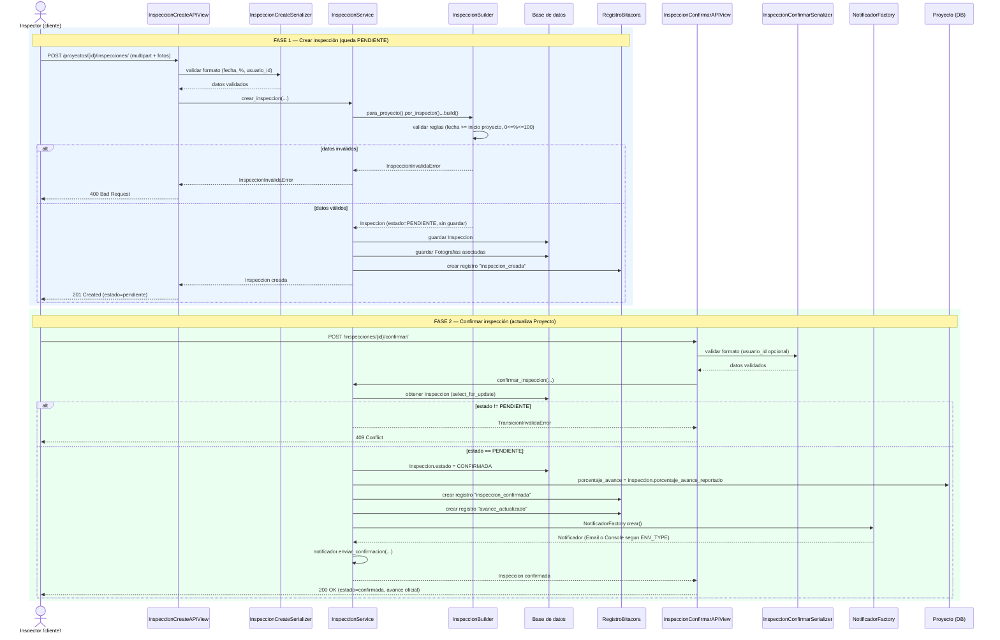

# Civix — Wiki Técnica — Entrega No. 1

**Curso:** Arquitectura de Software 2026 — Prof. Nicolás Ramírez Vélez
**Entrega:** Núcleo de Negocio y Exposición de API Profesional

---

## Índice

1. [Estructura de carpetas](#1-estructura-de-carpetas)
2. [Diagrama de secuencia: Crear y confirmar inspección](#2-diagrama-de-secuencia-crear-y-confirmar-inspección)
3. [SOLID y Service Layer aplicados](#3-solid-y-service-layer-aplicados)
4. [Justificación del Builder](#4-justificación-del-builder)
5. [Justificación de la Factory](#5-justificación-de-la-factory)
6. [Preparación para API Gateway](#6-preparación-para-api-gateway)
7. [Lista de endpoints](#7-lista-de-endpoints)
8. [Ejemplos de peticiones y respuestas](#8-ejemplos-de-peticiones-y-respuestas)
9. [Guía para ejecutar el proyecto](#9-guía-para-ejecutar-el-proyecto)
10. [Checklist final: PDF vs. implementación](#10-checklist-final-pdf-vs-implementación)
11. [Autenticación: preparada, no forzada (PASO 12)](#11-autenticación-preparada-no-forzada-paso-12)
12. [Frontend de demostración (PASO 13)](#12-frontend-de-demostración-paso-13)

---

## 1. Estructura de carpetas

```
civix_project/
├── civix_project/              # Configuración global de Django
│   ├── settings.py             # INSTALLED_APPS, DRF, MEDIA, TEMPLATES
│   ├── urls.py                 # Enrutador raíz (monta /api/ y /admin/)
│   └── templates/proyectos/    # Única vista HTML (crear proyecto)
│
├── proyectos/                  # Única app de dominio del sistema
│   ├── models.py                # Entidades del dominio (persistencia)
│   ├── admin.py                 # Registro en el panel administrativo
│   ├── serializers.py           # Entrada/salida DRF (solo formato)
│   ├── views.py                 # Capa de Presentación (APIView)
│   ├── urls.py                  # Rutas de la app
│   │
│   ├── domain/                  # Reglas de negocio PURAS (sin Django/HTTP)
│   │   ├── builders.py          # ProyectoBuilder, InspeccionBuilder
│   │   └── exceptions.py        # Excepciones de dominio (400 vs 409)
│   │
│   ├── infra/                   # Detalles de infraestructura externa
│   │   ├── factories.py         # NotificadorFactory
│   │   └── notificadores.py     # Implementaciones concretas de Notificador
│   │
│   ├── services/                # Capa de Aplicación (orquestación de casos de uso)
│   │   ├── __init__.py
│   │   ├── proyecto_service.py  # Caso de uso: Crear Proyecto
│   │   └── inspeccion_service.py# Casos de uso: Crear/Corregir/Confirmar Inspección
│   │
│   ├── migrations/
│   └── tests.py
│
├── requirements.txt
└── manage.py
```

### Justificación

- **`domain/` vs `infra/`**: `domain/` conoce únicamente reglas de negocio (no importa nada de DRF, HTTP, ni librerías externas). `infra/` conoce el "cómo" técnico de una dependencia externa (enviar un correo, por ejemplo). Esta separación es la que permite que `NotificadorFactory` cambie de implementación sin tocar ni una línea de `domain/` o `services/`.
- **`services/` como paquete (no archivo plano)**: cuando solo existía `ProyectoService`, un único archivo `services.py` era suficiente. Al agregar `InspeccionService` (un agregado de negocio completamente distinto), mantenerlos en el mismo archivo hubiera mezclado dos responsabilidades no relacionadas en un mismo módulo. Convertirlo en paquete es SRP aplicado también a nivel de organización de archivos, no solo de clases.
- **Una sola app (`proyectos`)**: para el tamaño de esta entrega (7 entidades relacionadas entre sí), separar en múltiples apps Django (`empresas`, `inspecciones`, etc.) habría introducido complejidad de imports cruzados sin beneficio real. Es una decisión consciente de simplicidad, no un descuido — se puede dividir en apps independientes más adelante si el dominio crece (ej. cuando se agregue Analítica/IA en entregas futuras).

---

## 2. Diagrama de secuencia: Crear y confirmar inspección

Este es el flujo de negocio más complejo del sistema — cubre el requisito de la Wiki Técnica del PDF ("diagrama de secuencia de la funcionalidad más compleja implementada").



**Lectura del diagrama:** ninguna flecha va directo de `View` a `DB` — siempre pasa por `Service` (Capa de Aplicación), que es quien decide si usar el `Builder`, cuándo escribir en `RegistroBitacora`, y cuándo consultar la `Factory`. Las vistas solo traducen HTTP ↔ excepciones de dominio.

---

## 3. SOLID y Service Layer aplicados

### Arquitectura en capas (de afuera hacia adentro)

```
HTTP request
    ↓
views.py (APIView)          → traduce HTTP ↔ dominio, NUNCA valida reglas de negocio
    ↓
serializers.py               → valida FORMATO (tipos, presencia, rango simple)
    ↓
services/ (Service Layer)    → orquesta el caso de uso completo (transacción, reglas)
    ↓
domain/builders.py           → construye y valida la ENTIDAD antes de persistir
    ↓
models.py                    → persistencia + validaciones de tipo de dato
```

### SRP (Single Responsibility Principle) — el más vigilado por la rúbrica

| Clase | Su única razón para cambiar |
|---|---|
| `InspeccionCreateAPIView` | Si cambia el protocolo HTTP de entrada/salida (ej. de JSON a otro formato) |
| `InspeccionCreateSerializer` | Si cambian los campos o el formato esperado en la petición |
| `InspeccionService` | Si cambia el ALGORITMO del caso de uso (ej. agregar un paso de aprobación extra) |
| `InspeccionBuilder` | Si cambian las reglas de qué hace válida a una Inspección al construirse |
| `Inspeccion` (modelo) | Si cambia cómo se persiste el dato en la base de datos |

Ningún `views.py` contiene cálculos ni validaciones de negocio (verificado: la única lógica en las vistas es "¿existe el recurso padre?" y "¿qué código HTTP corresponde a esta excepción?"). Ningún `Serializer` valida reglas cruzadas entre entidades (esas viven en `InspeccionBuilder._validar()` y en `InspeccionService`).

### Otros principios SOLID

- **OCP (Abierto/Cerrado):** agregar una tercera implementación de `Notificador` (ej. `SMSNotificador`) no requiere modificar `InspeccionService` ni `ProyectoService` — solo agregar la clase y una condición en `NotificadorFactory`.
- **LSP (Sustitución de Liskov):** `EmailNotificador` y `ConsoleNotificador` son intercambiables sin que `InspeccionService` note la diferencia — ambos cumplen el mismo contrato `Notificador.enviar_confirmacion()`.
- **ISP (Segregación de Interfaces):** `Notificador` es una interfaz mínima (un solo método) — nadie se ve forzado a implementar métodos que no necesita.
- **DIP (Inversión de Dependencias):** `InspeccionService.__init__(self, notificador)` recibe la dependencia inyectada desde afuera (la vista, vía la Factory) — el servicio nunca instancia `EmailNotificador()` directamente.

---

## 4. Justificación del Builder

**`InspeccionBuilder` es el Builder oficial de la entrega** (requisito 2.4: *"Builder obligatorio para la creación de la entidad más compleja de su sistema"*).

**¿Por qué `Inspeccion` y no `Proyecto`?**

| Criterio | `Proyecto` | `Inspeccion` |
|---|---|---|
| Relaciones que agrega | 1 (`Empresa`) | 3 (`Proyecto`, `Usuario`, `Fotografia[]`) |
| Estado inicial forzado | Sí (`PLANEADO`) | Sí (`PENDIENTE`) — y además es el punto de partida de una máquina de estados con reglas de transición |
| Validación cruzada con otra entidad | No | Sí: `fecha_visita >= proyecto.fecha_inicio` |
| Consecuencia de existir mal construida | Bajo impacto | Alto impacto: dispara actualización oficial de `Proyecto.porcentaje_avance` al confirmarse |

`ProyectoBuilder` se conserva (ya funcionaba bien y sigue siendo útil), pero `InspeccionBuilder` es el que demuestra un Builder resolviendo un problema real: sin él, la validación de "no inspeccionar antes del inicio del proyecto" y el forzado del estado `PENDIENTE` tendrían que vivir dispersos en la vista o el serializer — exactamente lo que el PDF prohíbe.

---

## 5. Justificación de la Factory

**`NotificadorFactory`** decide en tiempo de ejecución, según la variable de entorno `ENV_TYPE`, qué implementación de `Notificador` entregar:

- `ENV_TYPE=REAL` → `EmailNotificador` (producción)
- Cualquier otro valor (o ausente) → `ConsoleNotificador` (desarrollo/pruebas)

Esto cumple textualmente el requisito 2.4 del PDF: *"Factory obligatorio para gestionar al menos una dependencia externa o variante de lógica (Notificaciones, pasarelas de pago, o generadores de reportes)"* — elegimos la variante de **Notificaciones**.

**Por qué no es un adorno:** la misma Factory se reutiliza en **dos casos de uso distintos** (`ProyectoService.crear_proyecto` e `InspeccionService.confirmar_inspeccion`), demostrando que resuelve un problema recurrente real del sistema (avisar a la empresa cuando algo relevante ocurre), no solo un ejemplo aislado para cumplir la rúbrica.

---

## 6. Preparación para API Gateway

El sistema está diseñado para poder colocarse detrás de un API Gateway (Kong, AWS API Gateway, NGINX+Auth, etc.) sin refactorizar la lógica de negocio:

1. **Todos los endpoints de negocio están bajo un único prefijo (`/api/`)**, lo que permite versionar fácilmente a futuro (`/api/v1/...`) agregando un solo `include()` adicional en `civix_project/urls.py`, sin tocar `proyectos/urls.py`.
2. **Las vistas son *stateless*:** no dependen de sesión de servidor para las operaciones de negocio (`AllowAny`, sin `SessionAuthentication`). Un Gateway puede añadir autenticación (JWT, API Keys) como una capa externa sin modificar ninguna `APIView`.
3. **Contrato de errores uniforme:** toda respuesta de error usa la forma `{"error": "mensaje"}` con el código HTTP correcto (400/404/409). Un Gateway puede interceptar y transformar estas respuestas de forma predecible (ej. logging centralizado, formato estándar de error corporativo) sin necesitar conocer la lógica interna.
4. **Separación Presentación/Aplicación:** como la lógica de negocio vive en `services/` y `domain/` (y no en las vistas), el mismo caso de uso (`InspeccionService.confirmar_inspeccion`) podría exponerse mañana por un protocolo distinto (ej. un consumidor de cola de mensajes, o GraphQL) construyendo solo una nueva capa de Presentación delgada — sin duplicar ni reescribir reglas de negocio.
5. **Siguiente paso natural (no implementado en esta entrega, evolución futura):** agregar `DEFAULT_AUTHENTICATION_CLASSES` con JWT y `DEFAULT_THROTTLE_CLASSES` en `settings.py` — el Gateway pasaría el token, y DRF lo validaría, sin que ninguna vista cambie una sola línea.

---

## 7. Lista de endpoints

| Método | Endpoint | Descripción | Códigos posibles |
|---|---|---|---|
| `GET` | `/` | Info general de la API | 200 |
| `GET` | `/api/login/` | Página HTML de login | 200 |
| `GET` | `/api/panel/` | Panel adaptativo (operativo/gerencial) | 200 |
| `POST` | `/api/auth/login/` | Iniciar sesión (emite token) | 200, 401 |
| `POST` | `/api/auth/logout/` | Cerrar sesión (invalida token) | 200 |
| `GET` | `/api/auth/me/` | Usuario autenticado actual (**seguridad activada**) | 200, 401 |
| `GET` | `/api/empresas/<uuid:empresa_id>/proyectos/crear/` | Página HTML (formulario) para crear proyecto | 200, 404 |
| `GET` | `/api/empresas/<uuid:empresa_id>/proyectos/` | Listar proyectos de una empresa | 200, 404 |
| `POST` | `/api/empresas/<uuid:empresa_id>/proyectos/` | Crear proyecto | 201, 400, 404 |
| `GET` | `/api/proyectos/<uuid:proyecto_id>/` | Detalle de un proyecto | 200, 404 |
| `GET` | `/api/proyectos/<uuid:proyecto_id>/bitacora/` | Listar bitácora del proyecto | 200, 404 |
| `GET` | `/api/proyectos/<uuid:proyecto_id>/inspecciones/?estado=` | Listar inspecciones de un proyecto (filtro opcional) | 200, 404 |
| `POST` | `/api/proyectos/<uuid:proyecto_id>/inspecciones/` | Crear inspección (multipart, con fotos) | 201, 400, 404 |
| `PATCH` | `/api/inspecciones/<uuid:inspeccion_id>/corregir/` | Corregir inspección pendiente | 200, 400, 404, 409 |
| `POST` | `/api/inspecciones/<uuid:inspeccion_id>/confirmar/` | Confirmar inspección | 200, 404, 409 |

---

## 8. Ejemplos de peticiones y respuestas

Todos los ejemplos siguientes fueron **verificados realmente** contra el servidor (no son hipotéticos).

### 8.1 Crear proyecto

```
POST /api/empresas/590c242d-072b-46e6-8f54-775ae11d1c2c/proyectos/
Content-Type: application/json
```
```json
{
  "nombre": "Torre Aurora",
  "descripcion": "Edificio residencial",
  "fechaInicio": "2026-01-01",
  "fechaFin": "2026-12-31"
}
```
**201 Created**
```json
{
  "id": "c62c06fb-b465-4b01-8d02-38d127c044b5",
  "empresa": "590c242d-072b-46e6-8f54-775ae11d1c2c",
  "responsable": null,
  "nombre": "Torre Aurora",
  "descripcion": "Edificio residencial",
  "ciudad": "",
  "tipo_proyecto": "",
  "estado": "planeado",
  "riesgo": "bajo",
  "presupuesto": null,
  "porcentaje_avance": "0.00",
  "fecha_inicio": "2026-01-01",
  "fecha_fin": "2026-12-31",
  "imagen_principal": ""
}
```

### 8.2 Crear inspección (con foto)

```
POST /api/proyectos/c62c06fb-b465-4b01-8d02-38d127c044b5/inspecciones/
Content-Type: multipart/form-data
```
```
usuario_id=e4d9fea6-7043-4ea7-924b-50326cd9e5a4
tipo_inspeccion=avance_general
observaciones=Avance dentro de lo previsto.
fecha_visita=2026-08-22
porcentaje_avance_reportado=74
fotografias=<archivo foto1.png>
```
**201 Created**
```json
{
  "id": "86bc826b-93a5-469c-bc6e-38378b36bfe5",
  "proyecto": "c62c06fb-b465-4b01-8d02-38d127c044b5",
  "inspector": "e4d9fea6-7043-4ea7-924b-50326cd9e5a4",
  "inspector_nombre": "Julian Cortes",
  "tipo_inspeccion": "avance_general",
  "tipo_inspeccion_display": "Avance general",
  "estado": "pendiente",
  "estado_display": "Pendiente",
  "observaciones": "Avance dentro de lo previsto.",
  "fecha_visita": "2026-08-22",
  "porcentaje_avance_reportado": "74.00",
  "creado_en": "2026-08-25T09:21:39.597590Z",
  "confirmada_en": null,
  "fotografias": [
    {
      "id": "62c28df8-7771-4f9a-834c-a0ff8a07766d",
      "imagen": "/media/inspecciones/2026/08/foto1.png",
      "categoria": "",
      "subida_en": "2026-08-25T09:21:39.598892Z"
    }
  ]
}
```

### 8.3 Confirmar inspección

```
POST /api/inspecciones/86bc826b-93a5-469c-bc6e-38378b36bfe5/confirmar/
Content-Type: application/json
```
```json
{ "usuario_id": "e4d9fea6-7043-4ea7-924b-50326cd9e5a4" }
```
**200 OK** — `"estado": "confirmada"`, `"confirmada_en"` con timestamp.

### 8.4 Confirmar la misma inspección otra vez (conflicto)

```
POST /api/inspecciones/86bc826b-93a5-469c-bc6e-38378b36bfe5/confirmar/
```
**409 Conflict**
```json
{ "error": "La inspección ya fue confirmada anteriormente." }
```

### 8.5 Ver proyecto tras confirmar (avance ya oficial)

```
GET /api/proyectos/c62c06fb-b465-4b01-8d02-38d127c044b5/
```
**200 OK**
```json
{
  "id": "c62c06fb-b465-4b01-8d02-38d127c044b5",
  "nombre": "Torre Aurora",
  "porcentaje_avance": "74.00",
  "...": "..."
}
```

### 8.6 Ver bitácora del proyecto

```
GET /api/proyectos/c62c06fb-b465-4b01-8d02-38d127c044b5/bitacora/
```
**200 OK**
```json
[
  {"accion": "avance_actualizado", "descripcion": "Avance actualizado al 74.00%.", "..." : "..."},
  {"accion": "inspeccion_confirmada", "descripcion": "Inspección confirmada por Julian Cortes.", "...": "..."},
  {"accion": "inspeccion_creada", "descripcion": "Inspección Avance general registrada por Julian Cortes. Queda pendiente de confirmación.", "...": "..."}
]
```

### 8.7 Crear inspección con fecha inválida (400)

```
POST /api/proyectos/<id>/inspecciones/
```
```
fecha_visita=2025-01-01   (anterior al inicio del proyecto)
```
**400 Bad Request**
```json
{ "error": "La fecha de visita no puede ser anterior al inicio del proyecto." }
```

---

## 9. Guía para ejecutar el proyecto

```bash
# 1. Clonar el repositorio
git clone <url-del-repo>
cd civix_project

# 2. Crear entorno virtual
python -m venv venv
source venv/bin/activate        # Windows: venv\Scripts\activate

# 3. Instalar dependencias
pip install -r requirements.txt

# 4. Aplicar migraciones
python manage.py migrate

# 5. (Opcional) Crear superusuario para el panel /admin/
python manage.py createsuperuser

# 6. Correr las pruebas (deben pasar las 11)
python manage.py test

# 7. Levantar el servidor
python manage.py runserver

# 8. Probar
# - Interfaz HTML:  http://127.0.0.1:8000/api/empresas/<empresa_id>/proyectos/crear/
# - API:            http://127.0.0.1:8000/api/...
# - Admin:          http://127.0.0.1:8000/admin/
```

**Nota:** para crear un proyecto necesitas una `Empresa` con una `Suscripcion` activa. Créalas primero desde `/admin/` (o con `python manage.py shell`) antes de probar los endpoints.

---

## 10. Checklist final: PDF vs. implementación

| Requisito del PDF | Implementado | Evidencia |
|---|:---:|---|
| 50–60% de clases del dominio | ✅ | 7 clases: `Empresa`, `Usuario`, `Suscripcion`, `Proyecto`, `Inspeccion`, `Fotografia`, `RegistroBitacora` |
| Tipos de datos y validaciones a nivel de modelo | ✅ | `TextChoices`, `MinValueValidator`/`MaxValueValidator` en porcentajes |
| Nada de lógica de negocio en Views/Serializers | ✅ | Verificado: views solo traducen HTTP↔dominio; serializers solo formato |
| Cada flujo orquestado por una clase en `services.py` | ✅ | `ProyectoService`, `InspeccionService` (paquete `services/`) |
| SOLID / SRP | ✅ | Ver sección 3 |
| Serializers de entrada/salida | ✅ | `serializers.py` (8 serializers) |
| `APIView` | ✅ | Todas las vistas de API heredan de `rest_framework.views.APIView` |
| Códigos HTTP 201/400/404/409 | ✅ | Verificado con pruebas automatizadas y peticiones reales (sección 8) |
| Builder para la entidad más compleja | ✅ | `InspeccionBuilder` (ver sección 4) |
| Factory para dependencia externa/variante de lógica | ✅ | `NotificadorFactory` (ver sección 5) |
| Wiki: estructura de carpetas | ✅ | Sección 1 |
| Wiki: diagrama de secuencia del flujo más complejo | ✅ | Sección 2 |
| Wiki: preparación para API Gateway | ✅ | Sección 6 |

**Estado general: todos los criterios de la rúbrica cubiertos con evidencia verificable (18 pruebas automatizadas + peticiones HTTP reales documentadas).**

---

## 11. Autenticación: preparada, no forzada (PASO 12)

Se implementó login real para los dos tipos de usuario descritos en la visión de producto — **operativo** (`administrador`, `supervisor`, `colaborador`) y **gerencial** (`gerente`) — sin exigirlo todavía en ningún endpoint de negocio existente.

### Cómo funciona hoy

1. `POST /api/auth/login/` valida correo + contraseña (hasheada con `django.contrib.auth.hashers`, nunca en texto plano) y emite un `SesionToken`.
2. `TokenAccesoAuthentication` (registrada globalmente) puebla `request.user` **si** llega un token válido en la cabecera `Authorization: Token <token>`.
3. `DEFAULT_PERMISSION_CLASSES` sigue en `AllowAny`: **ningún endpoint de negocio exige ese token todavía.**
4. `GET /api/auth/me/` es el único endpoint con la seguridad **ya activada** (`permission_classes = [IsAuthenticated]`) — es la referencia concreta de cómo activarla en cualquier otra vista.

### Cómo activar más seguridad en el futuro (sin romper nada)

| Qué activar | Cómo |
|---|---|
| Exigir login en una vista puntual | Agregar `permission_classes = [IsAuthenticated]` a esa vista |
| Exigir login en todo el sistema | Cambiar `DEFAULT_PERMISSION_CLASSES` en `settings.py` a `IsAuthenticated` |
| 2FA | `Usuario.dos_fa_habilitado` ya existe como flag; `AuthService.iniciar_sesion()` documenta el punto exacto de extensión (estado intermedio "requiere_2fa" antes de emitir el token) |
| Dispositivo autorizado / mTLS | `SesionToken.dispositivo` ya guarda la etiqueta del dispositivo; `TokenAccesoAuthentication.authenticate()` es el lugar donde se validaría el certificado de cliente antes de aceptar el token |

### Por qué no se reutilizó `rest_framework.authtoken`

El módulo de tokens de DRF asume el modelo `django.contrib.auth.models.User`. Este proyecto ya tenía su propio modelo `Usuario` (con su propio `rol`, `empresa`, etc.) desde el taller original — adoptar `authtoken` hubiera significado mezclar dos sistemas de usuario paralelos. Se optó por un `SesionToken` propio, más simple y coherente con la arquitectura ya existente.

---

## 12. Frontend de demostración (PASO 13)

Dos páginas HTML (vanilla JS, sin frameworks ni build step, consistente con la filosofía de "no gastar tiempo en diseño visual" de la entrega):

- **`/api/login/`** — formulario de acceso. Al autenticar, guarda `token` y datos del `usuario` en `localStorage` y redirige al panel.
- **`/api/panel/`** — panel único **adaptativo**: si `usuario.es_gerencial` es `true`, solo se muestran las secciones de consulta (proyectos, bitácora); si es un rol operativo, además se muestran los formularios de creación de proyecto/inspección y la bandeja de inspecciones pendientes con acciones de confirmar/corregir.

Cada petición del panel ya envía `Authorization: Token <token>` (mediante el helper `civixFetch()`), aunque hoy ningún endpoint lo exige — el frontend queda listo para el día que se active `IsAuthenticated` de forma global, sin necesitar ningún cambio de JavaScript.

**Flujo completo verificado real** (login → crear proyecto → crear inspección con foto → confirmar → bitácora actualizada → logout): ver PASO 13 de la guía de implementación para la salida exacta obtenida.
